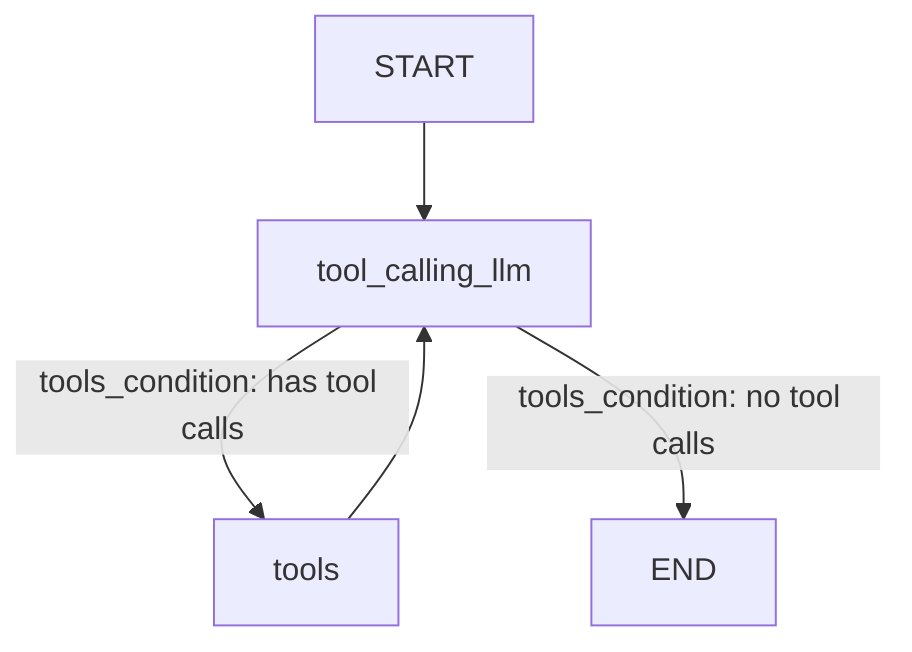

# Agentic LangGraph Chatbot

An interactive agentic chatbot built using **LangGraph**, **LangChain**, and **Groq Cloud LLMs**. The agent is equipped with dynamic tool-calling capabilities (web search via Tavily and a custom multiplication tool) and manages conversation state through a robust graph-based workflow. 

## 🚀 Key Features

*   **Stateful Conversations:** Powered by LangGraph's `StateGraph` to track, append, and maintain chat history.
*   **Dynamic Tool Calling:** The agent automatically decides when to use external tools to answer questions:
    *   **Web Search:** Powered by `TavilySearch` to retrieve real-time news and web data.
    *   **Custom Math Tool:** A custom multiplication tool for precise calculations.
*   **Looping Execution Flow:** The agent routes tool results back to the LLM to synthesize the final answer before ending the execution.
*   **Fast Inference:** Powered by Groq's low-latency `llama-3.1-8b-instant` or `llama-3.3-70b-versatile` models.
*   **Modern Python Tooling:** Uses `uv` for fast, reproducible dependency resolution and virtual environment management.

## 🛠️ Graph Architecture

The workflow routes messages dynamically according to the diagram below:



1. **`tool_calling_llm`**: Invokes the LLM bound with tools using the current conversation history.
2. **`tools_condition`**: A conditional router that inspects the LLM's response.
    * If the LLM requests a tool call, it routes the message to the **`tools`** node.
    * If the LLM responds directly with a message, it routes to **`END`**.
3. **`tools`**: Executes the requested tools and routes results back to `tool_calling_llm` to synthesize the final response.


## 📋 Prerequisites

*   Python 3.10+
*   [uv](https://github.com/astral-sh/uv) (Recommended package and environment manager)
*   A Groq Cloud API Key (Get one from [Groq Console](https://console.groq.com/))
*   A Tavily API Key (Get one from [Tavily AI](https://tavily.com/))

## ⚙️ Installation & Setup

### 1. Clone the Repository
```bash
git clone https://github.com/Soujuhegde/AGENTIC_LANGRAPH.git
cd AGENTIC_LANGRAPH
```

### 2. Set Up the Environment
Create and sync the virtual environment using `uv`:
```bash
# Create the virtual environment and install all dependencies
uv sync
```

### 3. Configure Environment Variables
Copy `.env.example` to `.env` and enter your actual API keys:
```bash
copy .env.example .env
```
Inside your `.env` file, configure:
```env
GROQ_API_KEY=gsk_your_groq_api_key
TAVILY_API_KEY=tvly-your_tavily_api_key
```

---

## 💻 Usage

1. Open your code editor (e.g., VS Code) and activate the virtual environment:
   ```bash
   .venv\Scripts\activate
   ```
2. Open `chatbot.ipynb` in your Jupyter Notebook interface.
3. Select the `.venv` Python kernel.
4. Run all cells to initialize the state graph and chat with the agent.

--- 

## 📦 Dependencies

The core libraries managed in `pyproject.toml` include:
*   `langgraph` - Orchestrates the agent workflow.
*   `langchain` / `langchain-core` - Standard interfaces for LLMs and tools.
*   `langchain-groq` - Groq LLM integration.
*   `langchain-tavily` - Tavily search engine tool.
*   `python-dotenv` - Loads configuration keys from the `.env` file.